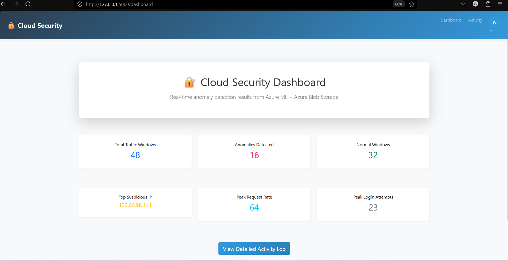
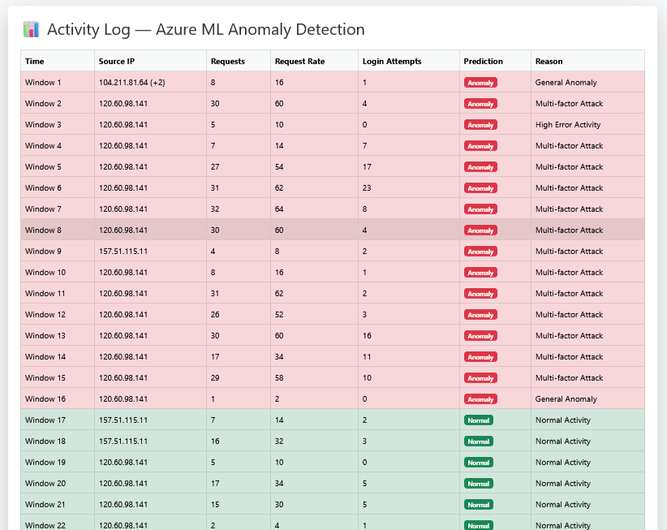

# 🔐 AI-Based Anomaly Detection for Cloud Network Security Logs Using Microsoft Azure

<div align="center">


### 🚀 Real-Time Cloud Security Monitoring & Anomaly Detection System

</div>

---

# 📌 Overview

This project implements an **AI-powered cloud security anomaly detection system** using:

* ☁️ Microsoft Azure
* 🤖 Isolation Forest Machine Learning Algorithm
* 📊 Flask Dashboard
* 📁 Azure Blob Storage
* 📈 Azure Monitor Logs

The system continuously analyzes cloud network logs and identifies suspicious activities such as:

* Brute-force attacks
* High error-rate traffic
* Abnormal request spikes
* Multi-factor attack patterns
* Unauthorized access attempts

The project provides **real-time anomaly visualization** through a Flask-based web dashboard.

---

# ✨ Features

✅ Real-time anomaly detection
✅ Azure Monitor log integration
✅ Machine Learning-based detection
✅ Flask interactive dashboard
✅ Brute-force attack simulation
✅ Azure Blob Storage integration
✅ Activity monitoring dashboard
✅ Suspicious IP analysis
✅ Multi-feature traffic analysis
✅ Automated anomaly scoring

---

# 🏗️ System Architecture

```text
Azure Logs
     ↓
Feature Extraction (KQL)
     ↓
Data Preprocessing
     ↓
Isolation Forest Model
     ↓
Anomaly Detection
     ↓
Azure Blob Storage
     ↓
Flask Dashboard Visualization
```

---

# 🧠 Machine Learning Model

The project uses the **Isolation Forest Algorithm** for anomaly detection.

### Features Used

* Request Count
* Request Rate
* Login Attempts
* Failed Login Ratio
* Error Rate
* Average Latency
* Source IP Analysis

### Model Performance

| Metric    | Value  |
| --------- | ------ |
| Accuracy  | 87.5%  |
| Precision | 0.8125 |
| Recall    | 0.8125 |
| F1-Score  | 0.8125 |
| ROC-AUC   | 0.9121 |

---

# 📷 Dashboard Screenshots

## 🔹 Cloud Security Dashboard

> Save this image as:
>
> `screenshots/dashboard.png`

```md

```


---

## 🔹 Activity Log & Anomaly Detection

> Save this image as:
>
> `screenshots/activity-log.png`

```md

```


---

# 🛠️ Technologies Used

| Technology         | Purpose              |
| ------------------ | -------------------- |
| Python             | Backend & ML         |
| Flask              | Web Framework        |
| Microsoft Azure    | Cloud Platform       |
| Azure Monitor      | Log Collection       |
| Azure Blob Storage | Data Storage         |
| Scikit-learn       | Machine Learning     |
| Pandas             | Data Processing      |
| NumPy              | Numerical Operations |
| HTML/CSS           | Frontend UI          |

---

# 📂 Project Structure

```text
AI-Based-Anomaly-Detection-Azure/
│
├── app.py
├── attacker.py
├── requirements.txt
├── README.md
├── notebooks/
│   └── anomaly_detection.ipynb
├── screenshots/
│   ├── dashboard.png
│   └── activity-log.png
├── static/
├── templates/
└── .gitignore
```

---

# ⚙️ Installation & Setup

## 1️⃣ Clone Repository

```bash
git clone https://github.com/Santhoshkumar0913/AI-Based-Anomaly-Detection-Azure.git
```

---

## 2️⃣ Navigate to Project

```bash
cd AI-Based-Anomaly-Detection-Azure
```

---

## 3️⃣ Create Virtual Environment

```bash
python -m venv .venv
```

---

## 4️⃣ Activate Environment

### Windows

```bash
.venv\Scripts\activate
```

### Linux / Mac

```bash
source .venv/bin/activate
```

---

## 5️⃣ Install Requirements

```bash
pip install -r requirements.txt
```

---

## 6️⃣ Run Flask Application

```bash
python app.py
```

---

# 🚨 Attack Simulation

The project includes an `attacker.py` module that simulates:

* Brute-force attacks
* Abnormal traffic spikes
* Suspicious route access
* Failed login attempts

Run:

```bash
python attacker.py
```

---

# 📈 Results

* Total Traffic Windows: 48
* Normal Windows: 32
* Anomalies Detected: 16
* Peak Request Rate: 64
* Peak Login Attempts: 23

The system successfully detected:

* Multi-factor attacks
* High error activity
* Suspicious login behavior
* General anomalies

---

# 🔮 Future Enhancements

* Real-time alert notifications
* Deep Learning integration
* Auto IP blocking
* Live dashboard analytics
* AWS & GCP support
* User behavior analytics

---

# 👨‍💻 Team Members

### Team Name: **Luminous**

* P Santhoshkumar
* C Narasimman
* K Rakesh

---

# 📚 References

* Microsoft Azure Documentation
* Scikit-learn Documentation
* Isolation Forest Research Papers
* Azure Monitor Logs Documentation

---

# ⭐ Support

If you found this project useful:

⭐ Star the repository
🍴 Fork the repository
📢 Share with others

---

# 📬 Contact

### GitHub

https://github.com/Santhoshkumar0913
